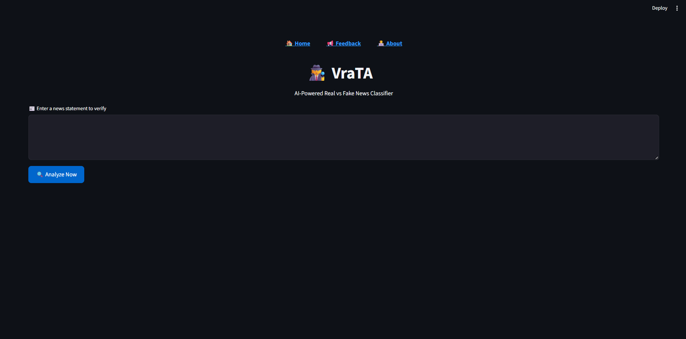
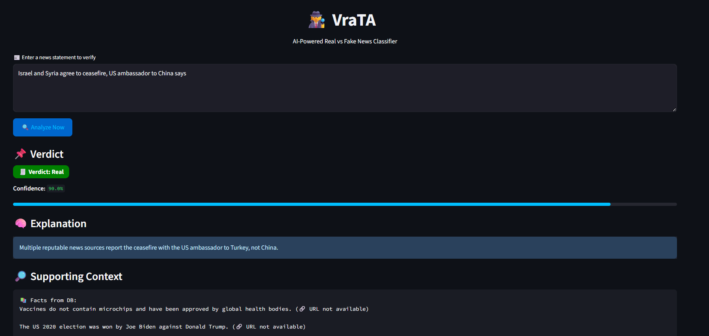
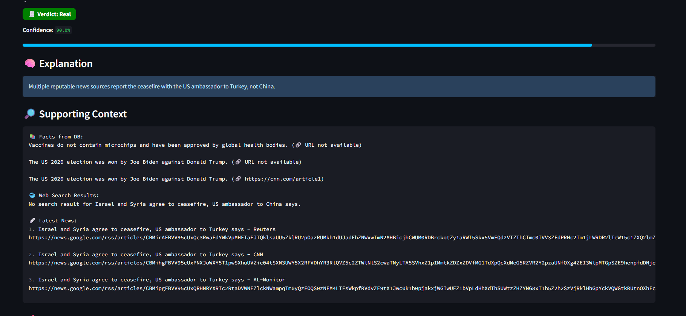

# 🕵️‍♀️ VraTA – Veracity Tracker & Analyzer

> **🚀 Hackathon Track**: SP25-AM02 – *News Veracity Detector*  
> **🎯 Theme**: "Create a system that checks the authenticity of news articles using NLP and external sources. Outputs a credibility score and facts to support/refute the article."

---
## Demo Link & Deployement Link
### Demo Link : https://drive.google.com/file/d/1UejBC_4fy6TIQqoSuZ3DKYT4rsmsv_yJ/view?usp=sharing
### Deployed Link : 

## 🧠 Problem Statement

In the age of viral misinformation, there's an urgent need for tools that can **automatically validate the truth of news claims** and provide users with **explainable evidence**. VraTA is built to **fact-check news statements** using:

- 🔎 **Contextual Retrieval**
- 🧠 **LLM Reasoning**
- 📊 **Confidence Score**
- 🧾 **Supporting Evidence**
- 📢 **User Feedback Loop**

---
## ScreenShots
### home

### analysis window


## 💡 Real Example & Insight

**📰 Input Statement**:  
`"Israel and Syria agree to ceasefire, US ambassador to China says"`

---

### 🧾 VraTA Output:

- **📌 Verdict**: `Real`  
- **📊 Confidence**: `90.0%`  
- **🧠 Explanation (by LLM)**:  
  *"Multiple reputable news sources report the ceasefire with the US ambassador to Turkey, not China."*

- **🔎 Supporting Context**:
Israel and Syria agree to ceasefire, US ambassador to Turkey says – CNN ✅

No results found for US ambassador to China in this context ❌


---

### 🤔 Interpretation

- The **LLM classified the claim as "Real"**, likely due to the correct nature of the **ceasefire claim**, despite the wrong attribution (`China` vs `Turkey`).
- However, the **LLM explanation itself acknowledges** that **all news reports refer to Turkey**, **not China**, subtly **exposing the inaccuracy** in the original claim.

🟢 This shows that **VraTA doesn't blindly trust text matching or generation** – it empowers **transparent, explainable AI** where the verdict and the reasoning can be **critiqued side by side**.

---

## 🧠 Architecture

Input → Contextual Retrieval → Web Search + DB → LLM + Guardrails → Verdict + Explanation + Sources → Feedback


---

## ✅ Key Features

| Feature                     | Description |
|----------------------------|-------------|
| 🧠 LLM-backed Reasoning     | NVIDIA Mixtral 8x7B via LangChain for structured JSON explanations |
| 📚 RAG Retrieval            | Combines AstraDB (semantic vector search) + Google News RSS + DuckDuckGo |
| ⚠️ Grounding Guardrails     | If **no relevant facts**, verdict defaults to `Fake` to avoid hallucination |
| 📊 Confidence Score         | Returned from LLM or fallback to 0% if unparseable |
| 📢 Feedback Capture         | User can mark verdict as correct/incorrect with reason |
| 🎨 Dark UI Theme            | Clean, badge-rich, modern Streamlit interface |
| 📖 Transparent Context      | All context is shown with source URLs or fallback notes |

---

## 🛠️ Stack

| Layer              | Tool |
|-------------------|------|
| LLM               | `mistralai/mixtral-8x7b-instruct` via `langchain_nvidia` |
| Embedding Model   | `all-MiniLM-L6-v2` (Sentence Transformers) |
| Vector DB         | `AstraDB` |
| Frontend          | `Streamlit` |
| Web Retrieval     | `Google News RSS`, `DuckDuckGo Search` |
| Feedback Store    | `AstraDB Collection` |
| Deployment Ready  | ✅ Local / Render / HuggingFace Spaces |

---

## 📁 File Structure

📦 app/
├── interface.py # Streamlit UI
├── explainer.py # LLM + reasoning
├── rag_retriever.py # DB + web context
├── feedback.py # Feedback storage
└── config/.env # Environment variables


---

## 🔐 `.env` Configuration

```env
ASTRA_DB_API_ENDPOINT=https://db-id-region.apps.astra.datastax.com
ASTRA_DB_APPLICATION_TOKEN=AstraCS:...
ASTRA_DB_COLLECTION=legal
NVIDIA_API_KEY=your-nvidia-api-key

✨ What Makes VraTA Special
Advantage	How VraTA Delivers
🧠 Human-like reasoning	Explanation contains real-world understanding, not just label
🛡️ Trust over hallucination	LLM only invoked with verified evidence
🌐 Web + Vector hybrid	Live news + long-term facts combined
🎯 Precise Hackathon Fit	Matches SP25-AM02 goals: credibility, evidence, score

🔁 Future Improvements
✅ Source highlighting

📆 Date-based filtering

🔁 Feedback-tuned verdict override

🗺️ Region-specific news validation

📲 API & mobile client

🤝 Built for
🎓 Smart India Hackathon 2025
🛠️ Track: SP25-AM02 — News Veracity Detector
📍 Developed by: Abhinav Sunil
🔗 Project: 

"In a world of misinformation, VraTA puts facts first and reasoning in your hands." 🕵️‍♀️📊